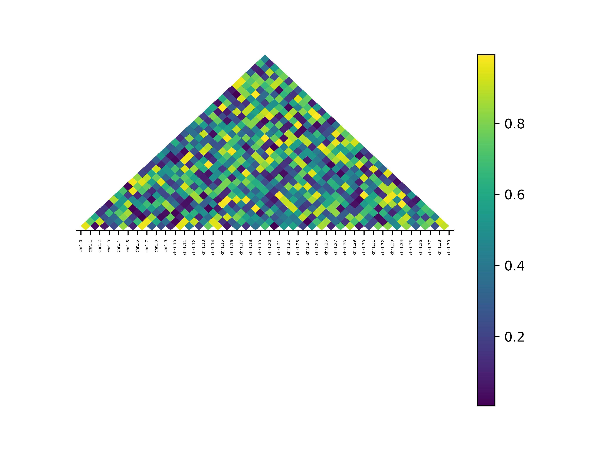

# LD plot

Plot of a Linkage Disequilibrium (LD) matrix in Python

## Installation

### pip

`pip install ld-plot`

## Usage

```python
from src.ld_plot.ld_plot import ld_plot

# LD: A symmetric LD matrix
# labels: A list of position names
figure = ld_plot(ld=LD, labels=labels)
figure.savefig('ld_plot.png')
```

## Example output

